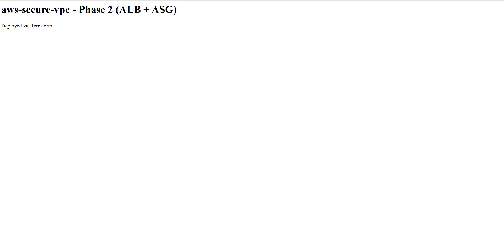
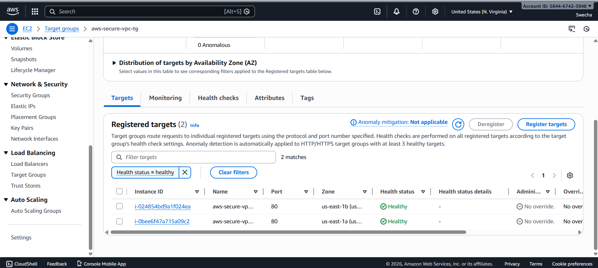
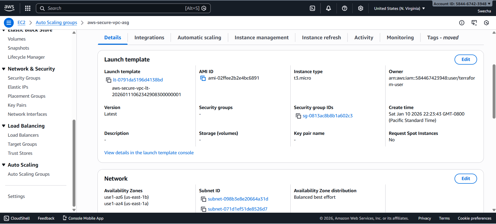

# AWS Secure VPC with ALB & Auto Scaling (Terraform)

Production-style AWS infrastructure built using Terraform, demonstrating secure networking, scalable compute, and real-world cloud architecture patterns.

---

## 🔹 Project Overview

This project implements a **secure and highly available AWS environment** using Infrastructure as Code (Terraform).  
It follows industry best practices by isolating workloads in private subnets, exposing traffic only through a public Application Load Balancer, and enabling automatic scaling and self-healing.

---

## 🏗️ Architecture Summary

### Network (Phase 1)
- Custom AWS VPC with DNS enabled
- Public and private subnets across multiple Availability Zones
- Internet Gateway for public access
- NAT Gateway for secure outbound access from private subnets
- Separate route tables for public and private tiers

### Compute & Traffic Management (Phase 2)
- Public **Application Load Balancer (ALB)** handling inbound HTTP traffic
- **Auto Scaling Group (ASG)** running EC2 instances in private subnets
- Launch Template with user data for automated instance bootstrapping
- Target Group with health checks for traffic routing and resilience
- Security Groups restricting access:
  - ALB allows HTTP from the internet
  - EC2 instances allow HTTP only from the ALB

---
## 🗺️ Architecture Diagram (Text)

Internet
  |
  |  HTTP :80
  v
[ Application Load Balancer (Public Subnets) ]
  |
  |  forwards to Target Group (health checks)
  v
[ Auto Scaling Group (Private Subnets) ]
  |
  |  outbound only (updates/bootstrapping)
  v
[ NAT Gateway (Public Subnet) ] ---> Internet

### Network Components
- **Public Subnets:** ALB + NAT Gateway (egress)
- **Private Subnets:** EC2 instances (ASG) with no direct inbound from internet
- **Routing**
  - Public route table: `0.0.0.0/0 → Internet Gateway`
  - Private route table: `0.0.0.0/0 → NAT Gateway`

### Security Groups
- **ALB SG:** allows inbound `HTTP 80` from `0.0.0.0/0`
- **App SG:** allows inbound `HTTP 80` only from **ALB SG**

---

## 📸 Screenshots

### Application Load Balancer – Browser Test


### Target Group – Healthy Targets


### Auto Scaling Group – Running Instances in Private Subnets


---

## 🔐 Security Design

- No direct internet access to EC2 instances
- Inbound traffic restricted to ALB only
- Outbound access from private instances via NAT Gateway
- Network segmentation using public/private subnets
- Least-exposure architecture aligned with AWS best practices

---

## 🧰 Tech Stack

- **AWS Services:**  
  VPC, Subnets, Route Tables, Internet Gateway, NAT Gateway,  
  Application Load Balancer, Target Groups, Listeners,  
  Auto Scaling Group, Launch Template, Security Groups, EC2

- **Infrastructure as Code:**  
  Terraform (modular design)

---

## 📁 Repository Structure

modules/
vpc/ # Reusable VPC Terraform module
envs/
dev/ # Development environment deployment
README.md


---

## 🚀 How to Deploy

```bash
cd envs/dev
terraform init
terraform plan
terraform apply